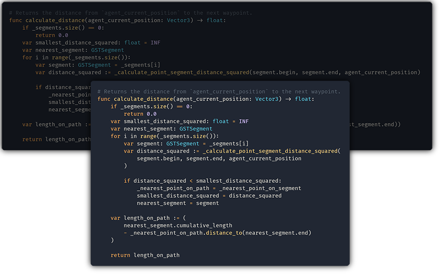

# GDScript Formatter

A [vscode extension](https://marketplace.visualstudio.com/items?itemName=Razoric.gdscript-toolkit-formatter)
  that runs Scony's [python-based GDScript formatter.](https://github.com/Scony/godot-gdscript-toolkit)

## Features

- Formats GDScript code using the `Format Document` command, or when
  format-on-save is activated.
- Command - `GDScript Format: Organize Script`: Re-orders GDScript
  elements of a script according to the official
  [style guide](http://docs.godotengine.org/en/latest/getting_started/scripting/gdscript/gdscript_styleguide.html#code-order).
- Command - `GDScript Format: Convert multiline comments to # comments`:
  Converts old-style multiline blocks to # comment blocks. """ Multiline
  strings """ are not optimized away by Godot when the game is built,
  and so are being obsoleted from the documentation.

## Requirements

- `Python3` and `pip` should both be installed.
- The `GDToolkit` module should be installed via pip, though if it is missing
  you will be prompted to install it.

## Extension Settings

- `gdscript_formatter.line_size`: The maximum size a given line can be before
  it is wrapped.

## Known Issues

### MacOS
 - if you get `ImportError: No module named gdtoolkit.formatter` or similar import error, make sure that VS Code uses `Python3` by setting `Python: Python Path` to `python3`. Alternatively in `settings.json`: `"python.pythonPath": "python3"`.

## Release Notes

### 1.1.0

Add the `Organize Script` and `Convert multiline comment blocks to #` commands.

Fix a bug that caused the last character, if it wasn't a newline, to repeat.

### 1.0.2

Fix to the README markdown and package.json

### 1.0.0

Initial release of the VSCode extension of GDScript Formatter.
